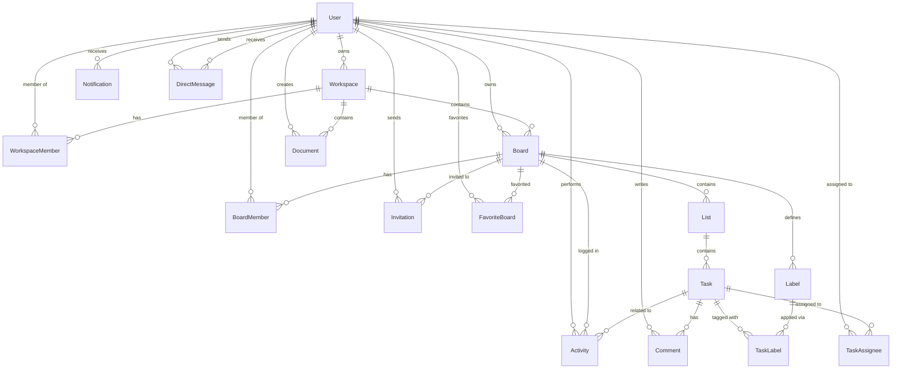

# Database Schema

## Overview

The application uses SQLite as the data store, accessed through Prisma ORM. SQLite was chosen for zero-setup local development and easy distribution — no external database server required.

The schema contains **17 models** organized around workspaces, boards, tasks, and collaboration features.

## Entity Relationship Diagram

## Models

### User
The central identity model. Every user has a unique email and hashed password. Acts as the foreign key anchor for ownership, membership, and activity tracking.

| Column | Type | Constraints |
|--------|------|-------------|
| id | String (CUID) | Primary Key |
| email | String | Unique, Indexed |
| name | String | |
| password | String | bcrypt hash |
| avatar | String? | URL or null |
| createdAt | DateTime | Auto |
| updatedAt | DateTime | Auto |

### Workspace
A top-level organizational container. Users create workspaces and invite others as members. Boards and documents belong to a workspace.

| Column | Type | Constraints |
|--------|------|-------------|
| id | String (CUID) | Primary Key |
| name | String | |
| color | String | Default `#6366f1` |
| icon | String? | |
| ownerId | String | FK → User, Indexed |
| createdAt / updatedAt | DateTime | Auto |

### WorkspaceMember
Join table between User and Workspace with a role field (`owner`, `admin`, `member`).

Unique constraint: `(workspaceId, userId)` — a user can only be a member once.

### Board
A Kanban board that belongs to a workspace. Contains lists, labels, and tracks activity.

| Column | Type | Notes |
|--------|------|-------|
| id | String (CUID) | PK |
| title | String | |
| description | String? | |
| color | String | Board accent color |
| ownerId | String | FK → User |
| workspaceId | String? | FK → Workspace (nullable for orphaned boards) |

### BoardMember
Join table with role (`owner`, `admin`, `member`). Controls access to board data.

### List
An ordered column within a board. Tasks are ordered within a list by `position`.

| Column | Type | Notes |
|--------|------|-------|
| position | Int | Indexed, determines left-right order |
| boardId | String | FK → Board |

### Task
The core work item. Lives inside a list and carries priority, due date, and position for drag-and-drop ordering.

| Column | Type | Notes |
|--------|------|-------|
| priority | String | `low`, `medium`, `high`, `urgent` |
| dueDate | DateTime? | Optional deadline |
| position | Int | Indexed, vertical ordering within a list |
| listId | String | FK → List |

### TaskAssignee
Many-to-many join between Task and User. Unique on `(taskId, userId)`.

### Label / TaskLabel
Labels are scoped to a board (each board defines its own color-coded labels). TaskLabel is the many-to-many join between Task and Label.

### Comment
Threaded comments on tasks. Tracks author and timestamps.

### Activity
An audit log of actions within a board. Stores a human-readable `description` and machine-readable `type` (e.g., `task_created`, `task_moved`, `member_added`). Optional JSON `metadata` for extra context.

Indexed on `boardId`, `userId`, and `createdAt` for efficient timeline queries.

### Invitation
Board-level invitations with a unique token, expiry date, and status (`pending`, `accepted`, `declined`). The invite link includes the token so unauthenticated users can sign up and auto-join.

### Notification
User-facing notifications (task assignments, comments, due reminders, etc.). Supports marking as read. The `metadata` field holds a JSON string with entity references.

Indexed on `userId`, `read`, and `createdAt` for fast inbox queries.

### Document
Rich-text documents stored as HTML strings. Scoped to a workspace with a creator reference. Supports the Docs page with TipTap editor.

### DirectMessage
Point-to-point messages between two users. Tracks read status. Dual foreign keys (`senderId`, `receiverId`) both reference User with separate relation names.

### FavoriteBoard
A simple join table to let users star boards for quick access. Unique on `(userId, boardId)`.

## Indexing Strategy

Indexes are placed on:

1. **Foreign keys** — Every FK column is indexed for join performance.
2. **Unique constraints** — Composite uniques on join tables (`workspaceId + userId`, `boardId + userId`, `taskId + userId`, `taskId + labelId`).
3. **Query patterns** — `position` on List and Task for ordering, `createdAt` on Activity and Notification for timeline queries, `read` on Notification for unread counts, `email` on User and `token` on Invitation for lookups.

## Migration History

Migrations are managed by Prisma Migrate and stored in `prisma/migrations/`.

| Migration | Description |
|-----------|-------------|
| `init` | Core models (User, Workspace, Board, List, Task, etc.) |
| `add_documents_and_messages` | Document and DirectMessage models |
| `add_favorite_boards` | FavoriteBoard model |

## Scaling Considerations

SQLite works well for development and small deployments. For production scale:

- Switch the Prisma provider to `postgresql` — the schema translates almost directly.
- Add connection pooling (PgBouncer or Prisma Accelerate).
- Consider partitioning Activity and Notification tables by date range.
- See [SCALABILITY.md](./SCALABILITY.md) for a full discussion.
